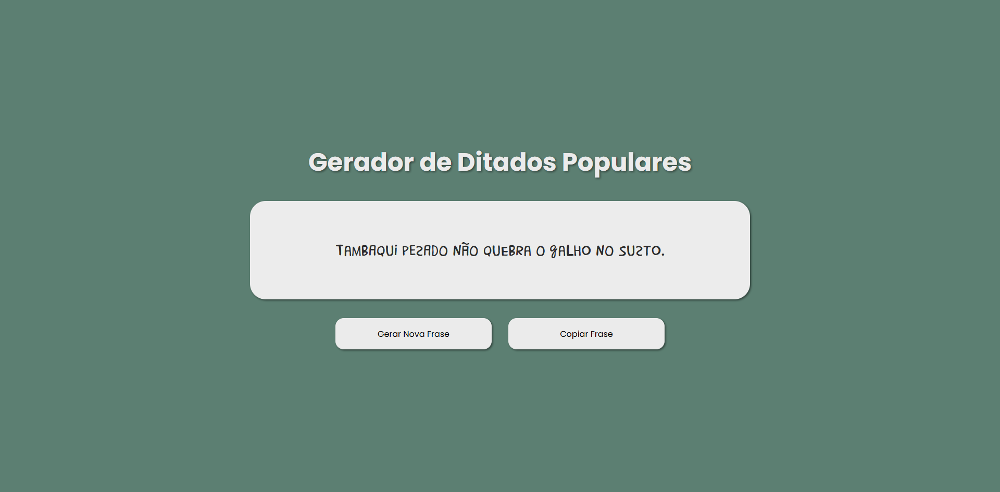

# 🎲 Gerador de Ditados Aleatórios

Um projetinho divertido que cria frases no estilo **“animal + adjetivo + não + complemento”**, perfeito pra gerar ditados malucos, engraçados e totalmente inesperados

## 🧠 Como funciona

O gerador combina palavras de quatro arquivos JSON:

* **animais.json**
* **adjetivos.json**
* **complemento.json**

Cada clique no botão cria uma combinação nova, sempre única e imprevisível.

## 🎨 Funcionalidades

* Gera ditados aleatórios
* Muda a cor do fundo automaticamente
* Botão para **copiar o ditado**
* Toast no canto da tela mostrando “Ditado copiado ✔️”
* Interface simples, responsiva e feita com **HTML, CSS e JS puros**

## 🛠️ Tecnologias usadas

* **HTML**
* **CSS**
* **JavaScript**
* **JSON** para armazenar as listas de palavras
